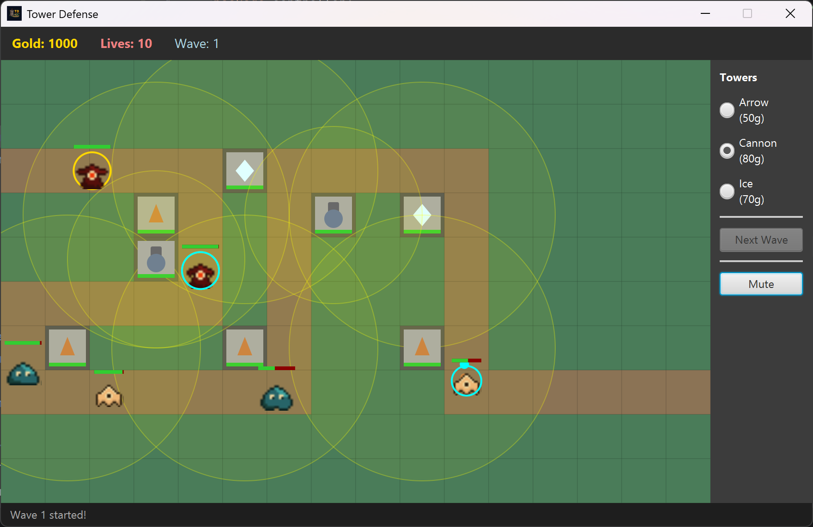

# Tower Defense Game

A 2D Tower Defense game built with Java, JavaFX, and multithreading as a university project.

---

## Screenshots

> __

---

## Features

- 3 tower types - Arrow, Cannon (splash), Ice (slow effect)
- 3 enemy types - Basic, Fast, Boss (with armor)
- Smooth enemy movement using pixel interpolation
- Projectile system with splash damage
- Wave-based spawning system
- Gold and Lives HUD
- Walking animation via sprite sheets
- Sound effects and background music
- Range circle display for all towers
- JUnit 5 test coverage

---

## Project Structure

```
src/
├── main/           - Entry point (Main.java)
├── controller/     - GameController, WaveController
├── model/
│   ├── entity/
│   │   ├── tower/  - Tower, ArrowTower, CannonTower, IceTower
│   │   └── enemy/  - Enemy, BasicEnemy, FastEnemy, FlyingEnemy, BossEnemy
│   ├── factory/    - TowerFactory
│   ├── GameMap.java
│   ├── Projectile.java
│   ├── SplashProjectile.java
│   └── TilePoint.java
├── interfaces/     - Attackable, Damageable, Renderable
├── thread/         - GameLoopThread, SpawnThread
├── util/           - GameConfig, SoundManager, SpriteSheet
└── test/
    ├── tower/      - ArrowTowerTest, CannonTowerTest, IceTowerTest, TowerFactoryTest
    ├── enemy/      - BasicEnemyTest, FastEnemyTest, BossEnemyTest
    └── system/     - ProjectileTest, GameMapTest, WaveControllerTest, GameControllerTest
```

---

## Requirements

| Item | Version      |
|---|--------------|
| Java | 24 or higher |
| JavaFX | 24 or higher |
| JUnit | 5            |

---

## How to Run

**From JAR file**

1. Download `<name-of-release>.jar` from [Releases](build/libs)
2. Create a new empty folder and place the JAR inside
3. Open a terminal and navigate to that folder
4. Run:

```bash
java --module-path <path-to-javafx-lib> --add-modules ALL-MODULE-PATH -jar <name-of-release>.jar
```

> The JAR must be run from inside the folder it is placed in.

**From Source (IntelliJ IDEA)**

1. Clone this repository
2. Open the project in IntelliJ IDEA
3. Add JavaFX SDK to the project libraries
4. Run `main.Main`

---

## How to Play

1. Select a tower type from the shop panel on the right
2. Click any grass tile on the map to place the tower
3. Press **Next Wave** to start spawning enemies
4. Enemies follow the path - if they reach the base you lose a life
5. Earn gold by killing enemies and spend it on more towers
6. The game ends when lives reach 0

**Tower types**

| Tower | Cost | Damage | Special |
|---|---|--------|---|
| Arrow | 50g | 15     | Single target, fast fire rate |
| Cannon | 80g | 20     | Splash damage in radius |
| Ice | 70g | 5      | Slows enemies by 60% for 2s |

**Enemy types**

| Enemy | HP | Speed | Reward | Special |
|---|---|---|---|---|
| Basic | 100 | Normal | 10g | - |
| Fast | 50 | 2x | 15g | Hard to hit |
| Fly | 80 | Faster | 20g | Only Arrow can hit |
| Boss | 500 | Slow | 50g | Armor reduces damage taken |

---

## OOP Design

| Concept | Implementation |
|---|---|
| Inheritance | `Entity -> Tower -> ArrowTower / CannonTower / IceTower` and `Entity -> Enemy -> BasicEnemy / FastEnemy / BossEnemy` |
| Interface | `Attackable` (Tower), `Damageable` (Enemy), `Renderable` (Tower + Enemy) |
| Polymorphism | `attack()` behaves differently per Tower type, `move()` per Enemy type, `render()` per class |
| Encapsulation | All fields are `private` or `protected`, accessed via getters and setters |
| Thread | `GameLoopThread` runs update + render at ~60fps, `SpawnThread` spawns enemies every 2s independently |

---

## Running Tests

Open the `test/` directory in IntelliJ and run all tests with JUnit 5, or run via Gradle/Maven if configured.

---

## JavaDoc

> _[View JavaDoc](docs/javadoc)_

---

## Team Members

[@tharawaranuset](https://github.com/tharawaranuset)

[@Neenom](https://github.com/Neenom)

---

## Course Info

- **Course:** Programming Methodology I (2110215)
- **Semester:** 2 / 2025